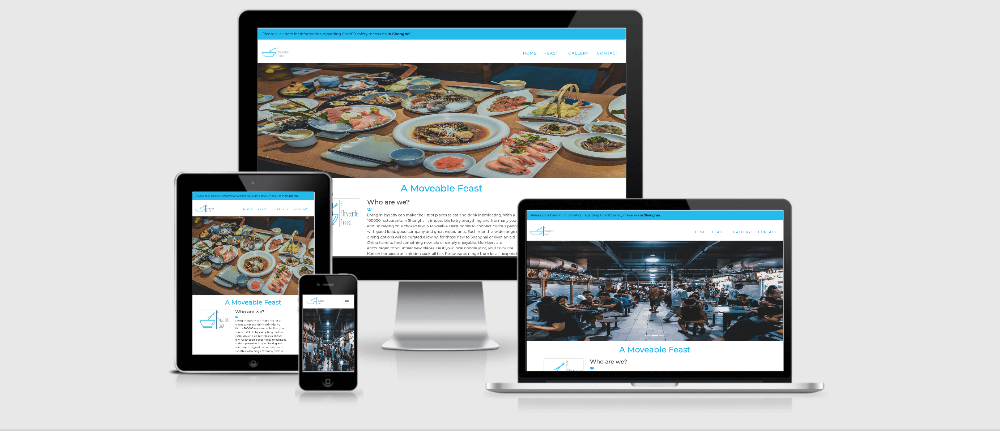
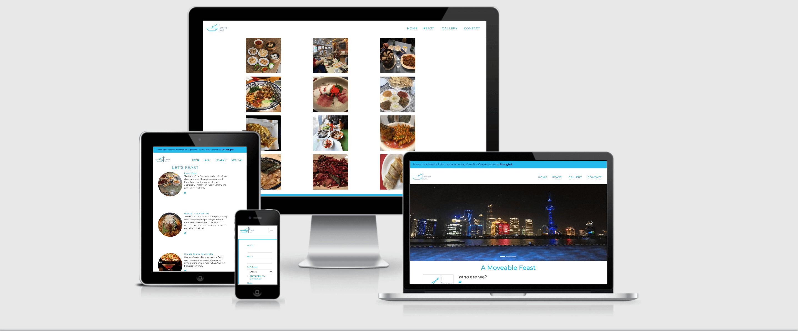

# **A Moveable Feast**

[View a live version of A Moveable Feast here](https://michellecoffey.github.io/A_Moveable_Feast_Shanghai/index.html)

This is the main website for *A Moveable Feast*. We hope to help foodies find local and international cusine amongst the 100,000 possible restaurant choices          in Shanghai. The site is designed to be responsive and accessible on a wide range of devices. Making it easy to navigate to all the relevant content.

 "A Moveable Feast on multiple displays"
 "A Moveable Feast on multiple displays"
## User Experience (UX)

* User Stories 
 
 1. First Time Visitor Goals

    a. First time visitors should be able to clearly access all materials that inform the user of possible events organised by A Moveable Feast. 
        There is an alert for covid related information that opens on a new page. The logo is clickable and the navbar contains links to the homepage, 
        feast (info regarding events), a gallery and a signup sheet. 
        
    b. The colours are attracted to the eye and do not detracted from the images.  On the homepage 
        or landing page the new user will learn about A Moveable Feast's hope to connect people to great new food and beverage offerings arouned the Shanghai. The 
        footer links to all social media links including facebook, twitter, instagram and wechat.
    
        
    c. Upon clicking the Feast page you see the offerings of local food nights, international food and drinks night. The utensil icons and cocktail icon also link to the sign up page.

    d. The sign up page is a smiple box that asks for the first user to sign up to receive invites to nights out in different restaurants. The user is encouraged to choose their preference between local, international and a bar night. 

    e. Finally the gallery page shows images of the many different types of food on offer as a means of enticing the new customer. 

    f. The pdf alert is there to offer reasurance to the user. It also has a QR code link to the city tracking app and a moveable feasts wechat account where customers can easily meassge any queries. 

 2. Returning Visitor Goals 

     Returning users can access any information they may have forgotten and use the active social media sites and we chat account. 

    

 3. Frequent User Goals 

    This is static site so less things will change and there will be little need for frequent users. Users can return to check if any images have been updated. 

  ## Design 

  * Color Scheme  

    Bright but relaxing colors  

  * Typography 
    
    What font do I intend to use? Sans Serif should be the fall back font as is the industry standard and is compatible on most devices. 

  * Imagery

    Images are incredibly important but it will attract the cutomer to the organisation. They will first engage with the food images. Then with those who participate in the events and finally with the different types of restaurtant. Images must depict diverse tastes and interests in order to attract a many and varied crowd. 

  # Deployment 

  ## Github
  ### The repository is hosted on github and I have therefore used github pages to deploy the site. 

    1. On Github, go to your site's repository.
    2. Under your repository name, click settings and scroll down to github pages. 
    3. Under the "Github pages:", use the None or Branch drop-down menu and select a publishing source. For a Moveable Feast, the master was selected, root and both actions were saved using the save button. A theme or custom domain were not chosen at this time. 
    4. After saving the actions. Next click the active link on the repository page on github. Full delpoyment may take a minute or two, so refresh the page and be patient. 
  
  ### Cloning of Repository to a local device.

    1. On GitHub, again go to the main page of the repository. 
    2. Above the ist of files, click Code. 
    3. To clone the repository using HTTPS, under "Clone with HTTPS", click. 
       To clone the repository using an SSH key, including a certificate issued by your organization's SSH certificate authority, click Use SSH, then click . 
       To clone a repository using GitHub CLI, click Use GitHub CLI, then click .
    4. Open Terminal 
    5. Change the cirrent working directory to the location where you want the cloned directory. 
    6. TYpe git clone, and then paste the URL you copied eariler. 
    7. Press Enter to create your local clone. 

  ### Cloning a repository to GitHub Desktop. 

  1. On GitHub, naviagte to the main page of the repository.
  2. Above the list of files, click Code. 
  3. Click  Open with GitHub Desktop to clone and open the repository with GitHub Desktop.
  4. Follow the prompts in GitHub Desktop to complete.

## Wireframes

* Wireframe for the whole project. [View](wireframe/amf.pdf)
  
## Features  

* Responsive on all devices and have interactive elements for bookings. Icons that link to further social media updates.

## Technologies Used 

### Languages Used 

* HTML

* CSS

### Frameworks, Libraries, and Programs Used 

1. [Bootstrap](https://www.getbootstrap.com)
  
    Bootstrap 4.6.X:

2. Hover.css:

3.  [Wix](https://www.wix.com/)

    Wix was used to make the logo for A moveable Feast. 

4. [Google Fonts](https://fonts.google.com/specimen/Montserrat?preview.text_type=custom)

5. [Fontawesome](https://fontawesome.com/)

    Fontawesome was used for to get icons for utensils and aa cocktail on the feast page. 

6. [Gitpod](https://gitpod.io/workspaces/)

    Used gitpod to work on my repositories. 

7. [Github](https://github.com/MichelleCoffey/A_Moveable_Feast_Shanghai/tree/1a91746d21707106faef91c699500aff9414e097)

     GitHub is hosting my repositories. 

8. JQuery: 

    * Is used by Bootstrap.

9. [Balsamiq](https://balsamiq.com/)

    * Balsamiq was used to design and organise my WireFrames. 

10. [TinyPNG](https://tinypng.com/)

     * Tinypng for fomatting images, so they. loaded faster.

11. [Unsplash](https://unsplash.com/)

    * Upsplash was used to access some stock images to add to the site and in particular the galllery and carousel. 

## Testing 

The W3C Mark Up Validator and W3C CSS Validator Services was used to validate each page of the website to ensure there were no syntax errors in the prioject. 
